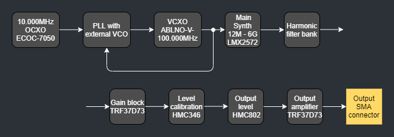

# Oscillar

Oscillar is an open-source, cheap, two output, RF CW generator covering from 12MHz to 6GHz, with an output 
power range of −60dBm to +15dBm on the main output.

This repository contains the complete system design, including block diagrams, schematics, 
PCB design files, firmware source code, documentation, and measurement results.

## Features

- Main output: 12MHz to 6GHz in CW operation
- Main output power: −60 dBm to +15 dBm
- PCB in aluminium enclosure for shielding
- Open-source hardware and firmware (GPLv3)

## Hardware overview

## Block diagram

## License

This project is licensed under the GNU General Public License v3.0 — see the 
[LICENSE](./LICENSE) file for details.
